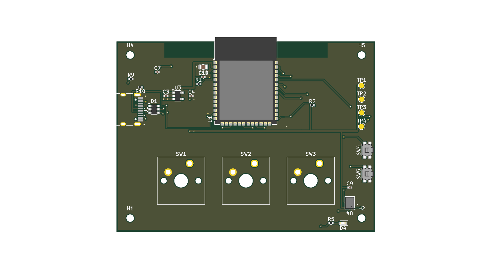
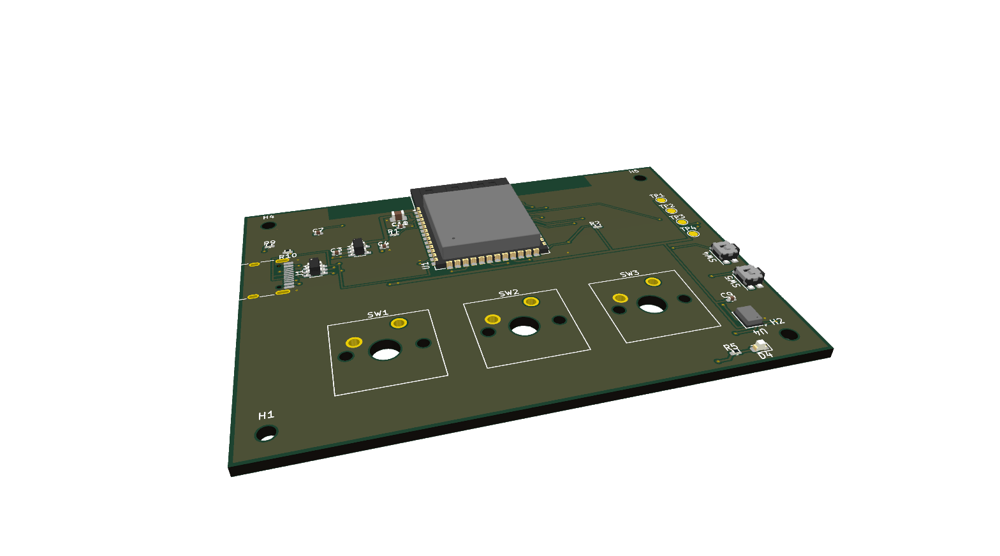

# mic-macropad

Three MX keys and an I2S microphone on an ESP32-S3-WROOM-1, powered over
USB-C. 76 × 56 mm, two layers, 30 parts, 19 nets — **DRC 0 error-severity,
0 unconnected**, routed by freerouting over a locked skeleton.





The board is small on purpose. What it is really an example *of* is the
method: a placement laid out as a **product** rather than as an engineering
board, contracts that no generator re-types, and an autorouting flow that is
reproducible instead of a fresh roll of the dice each build.

## Reproduce it

```bash
cd pcb/kicad
./route_fr.sh              # replay the accepted session -> DRC gate -> render
FRESH=1 ./route_fr.sh      # re-run freerouting instead (see "accepted session")
```

`KICAD_PY`, `KICAD_CLI`, `JAVA`, `FREEROUTING_JAR` and `KICAD_FOOTPRINT_DIRS`
all override the defaults; the script fails loudly if a tool is missing.

```bash
python3 ../../skills/vibe-plm/scripts/plm_check.py product.yaml   # contracts
```

## The sources (and what is an output)

| file | owns |
|---|---|
| [`cad/constraints.yaml`](cad/constraints.yaml) | outline, mount holes, USB port, key windows, **the antenna keepout** |
| [`pcb/parts.yaml`](pcb/parts.yaml) | ref → footprint / value / **pad→net** / placement |
| [`pcb/pinmap.yaml`](pcb/pinmap.yaml) | signal ↔ GPIO (pcb → firmware) |
| [`pcb/kicad/gen_pcb.py`](pcb/kicad/gen_pcb.py) | the generator: placement + pours + the locked routing skeleton |
| [`pcb/kicad/macropad.ses`](pcb/kicad/macropad.ses) | the **accepted** freerouting session |

`macropad.kicad_pcb` and everything beside it is generated and gitignored.

## The layout is a product, not a board

The first version had the keys mid-board, the ESD chip parked between two
keycaps, USB pointing at the user, and a pin header standing off the surface.
Every one of those was a routing convenience. The layout here answers to the
product instead:

- **The key row is the face.** Three MX caps on 19.05 mm centres, centred with
  an even bezel, and nothing else inside the key zone. (The round hole inside
  each key outline is the switch's own mounting post — it disappears under the
  switch body.)
- **USB-C exits the left edge**, so the cable leaves away from the typing
  hand, with the **ESD array beside the connector** where it belongs.
- **The WROOM sits on the back edge** with its antenna over the rear bezel.
- **Reset and boot are bring-up controls**, tucked either side of the module,
  not user-facing buttons.
- **The mic is at the front-right corner**, port facing the user and as far
  from the USB switching edge as the outline allows.
- **Four pogo test pads replace the debug header** — nothing protrudes.
- **Reset and boot are side buttons on the right wall.** They are
  side-actuated parts (Panasonic EVQ-P7C) with their actuator tips flush to
  the board edge, so a shell button presses them horizontally — the M5Stack
  arrangement. Rotating a top-actuated switch would not have achieved this:
  rotation turns the pads, not the direction the part is pressed from. The
  shell holes are in a wall rather than the top face, and
  `constraints.yaml` says so.

## How it is routed: a locked skeleton, then freerouting

`gen_pcb.py` pre-routes and **locks** (`SetLocked` → Specctra `(type fix)`)
everything that must hold: the USB fanout, the whole V3V3 tree, the GND stubs
for boxed-in pads, and the stitching vias. freerouting fills in the leaf
signals. Two reasons this shape is worth copying:

1. **freerouting is nondeterministic.** Successive runs fence off different
   pour pockets and leave different nets unrouted. Anything that must be true
   across runs belongs in the skeleton; the router only gets what it can't get
   wrong.
2. **Two pins of one net with another net between them** — the LDO's VIN (1)
   and EN (3) sit either side of GND (2). Left alone, freerouting wrapped the
   far side of the part in eight segments, squeezing between the ground pad
   and the output pins. Surfacing VBUS at pin 3's own height turns it into one
   straight run along the bottom with the input cap and VIN teed off it. Note
   the via is placed by the generator, not the router: a locked trace anchored
   to a router-chosen via moves on the next re-route.
3. **The interleaved USB-C pad column is a planarity puzzle**, not a routing
   one. Rotated 90°, the column runs `B7, A6, A7, B6` — bridging DP on the
   **left** of the column and DM on the **right** makes both pairs planar with
   zero layer changes. Same-side bridging always costs a via. Count the
   inversions before you draw lanes.

The gate is KiCad's DRC, never freerouting's own violation count — the two
disagree, and only one of them ships boards.

### Stitching vias, measured rather than accumulated

An earlier revision carried 27 GND stitching vias, added one at a time to
chase pour islands and kept through a re-placement. A leave-one-out sweep
(drop a via, refill, re-run DRC) found **25 of them were doing nothing** —
rescues for pockets that stopped existing when the parts moved. The board now
carries a set with a reason behind each one:

- **2 connectivity vias** — the ones the sweep proved load-bearing.
- **6 return-path vias** — one beside each layer change on the USB pair, the
  VBUS entry and the V3V3 spine. A signal that changes layer forces its return
  current to change layer too, and it can only do that through a nearby ground
  via. DRC never asks for these; they exist only because someone placed them.

Their positions were searched rather than guessed: each candidate was tried at
several offsets and kept only where the board still gated clean.

## What the vendor references corrected

The design existed first as a browser-side sketch with hand-drawn footprints.
Swapping in the official KiCad lands did more than tidy the pads:

- **The microphone land was miswired, not merely approximate.** The real
  ICS-43434 order is `1=WS 2=LR 3=GND 4=SCK 5=VDD 6=SD`; the invented land had
  `1=VDD … 6=WS`. Fabricated, that is a dead microphone — an EST that would
  have failed on the bench, not in review.
- **Espressif's antenna keepout is wider than a guess.** It ships as a rule
  area inside the official WROOM footprint: x ±24 mm, not the ±11 the sketch
  assumed. Two parts had to move, and the number now lives in
  `constraints.yaml` where the enclosure can read it too.
- **KiCad's `LED_0603` pad 1 is the CATHODE**, the opposite convention from
  the sketching tool's LED. Same designator, reversed part.

Everything still estimated is tracked in [`pcb/BRIEF.md`](pcb/BRIEF.md) §EST
and must be closed before ordering.

## Status

| domain | status | why |
|---|---|---|
| pcb | **clean** | DRC 0/0, gated by `route_fr.sh` |
| firmware | stub | not started; `pinmap.yaml` is ready for it |
| cad | stub | not modelled; `constraints.yaml` has every number a shell needs |

Not yet fabricated. The three hand-checked items before an order are in the
brief's EST register.
