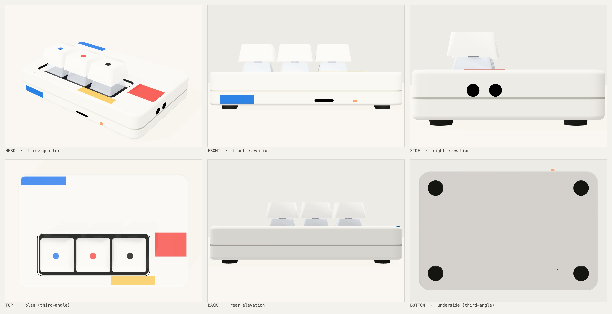
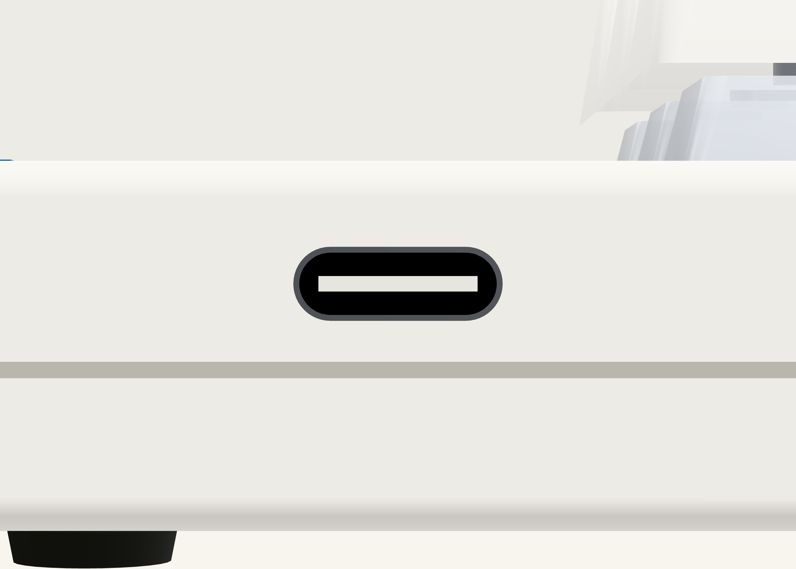

# mic-macropad — industrial design

Appearance only: form, proportion, split lines, control placement, CMF.
Structure — wall thickness, bosses, snap fits, board fit — belongs to
`vibe-cad`, and takes its numbers from [`scene/params.js`](scene/params.js).

**[`design-report.md`](design-report.md) is the authority.** Start at §0: the
constraints that had already decided the form before the first picture.



**93 × 62 × 18 mm.** Milky white PC, Mondrian primary blocks, three MX switches
left exposed in a black tray. Teenage Engineering × Mondrian, from the owner's
v2 sheet.

## Look at it

```bash
python3 ../../../skills/vibe-industrial-design/scripts/serve.py examples/mic-macropad/id/scene 5181
```

Then `http://127.0.0.1:5181/` to orbit, or drive it by URL:

| URL | does |
|---|---|
| `?sheet=1&save=1&scale=2` | the six-view contact sheet → `scene/out/sheet.png` |
| `?shot=1&view=hero&save=1` | one camera → `scene/out/shot-hero.png` |
| `?glb=1` | the Blender handoff → `scene/out/mic-macropad.glb` |
| `?fresh=1` | ignore stored slider deltas |

`scene/vendor/` (three.js) and `scene/out/` are gitignored — fetch three.js with:

```bash
curl -o scene/vendor/three.module.js https://unpkg.com/three@0.169.0/build/three.module.js
```

…plus `OrbitControls.js`, `GLTFExporter.js`, `TextureUtils.js` and
`RoomEnvironment.js` from `.../examples/jsm/` (GLTFExporter's import of
`./../utils/TextureUtils.js` needs rewriting to `./TextureUtils.js`).

## Where the numbers come from

Every dimension lives once, in `params.js`, tagged: `[pcb]` the board contract ·
`[std]` a real part or standard · `[v2]` the owner's sheet · `[eye]` tuned by
looking · `[ask]` wants a board change. A value with no tag is a bug.

The device is built in the **board's own frame** — x right, y away from the
user, z up — and the group is rotated once into three.js's y-up world, so a
board coordinate needs nothing but centring.

`parts.js` (sweep / plate / lathe / recess) is ported from the contrispeaker ID
scene; algorithms unchanged, comments translated, nothing product-specific
carried over.

## Reusable standard parts

Two modules are product-agnostic — drop them into another scene and they work:

- [`scene/mx.js`](scene/mx.js) — Cherry MX switch (14.0 / 15.6 sq housing,
  11.6 mm crown, cross stem) and an XDA/MA keycap. KiCad ships no 3D model for
  `Button_Switch_Keyboard` (those lands are copper only), so it is generated
  from datasheet numbers.
- [`scene/usbc.js`](scene/usbc.js) — USB Type-C receptacle. Outer body
  **measured off the KiCad land the board specifies** (`F.Fab` of
  `USB_C_Receptacle_HRO_TYPE-C-31-M-12` = 8.94 × 7.30 mm); cavity and tongue
  from the Type-C spec. Exports `USBC` (the numbers), `usbcCutout()` (the panel
  aperture outline) and `WALL_ROT` (the orientations — a Type-C port rendered
  portrait is unmistakable, and easy to produce by rotating about one axis).



## Three things worth defending in review

- **H = 18, not the sheet's captioned 22.** The MX stack reaches 22.7 mm; at a
  22 mm face the exposed-switch look is a 0.7 mm sliver. §0.8.
- **The rear band is blue because it may never be metal.** It is Espressif's
  antenna keepout, promoted to a split line. §1.3.
- **The board sits hard left, so the keys are off-centre.** A Type-C plug shell
  is 6.5 mm; a centred board puts the receptacle 8.5 mm down a tunnel no plug
  can bottom out in. §1.5.
